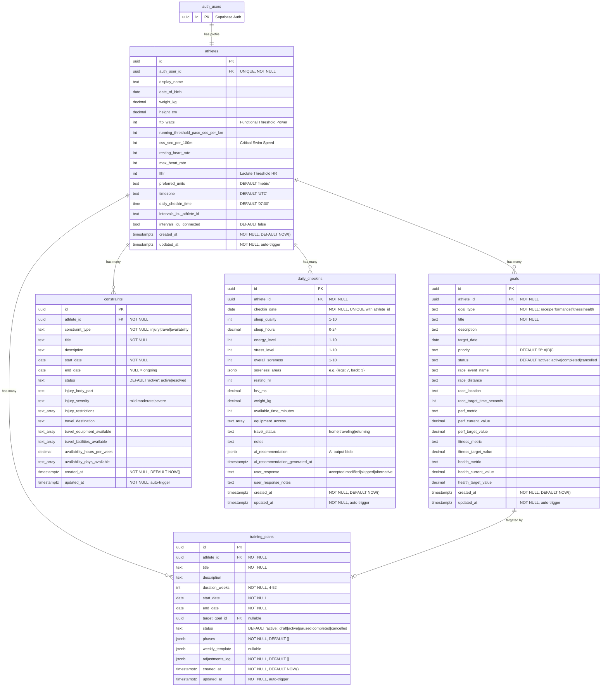

# Khepri Database Schema

This document describes the Supabase/PostgreSQL database schema for Khepri.

> **Last Updated**: 2026-02-08
> **Migration**: `supabase/migrations/001_initial_schema.sql`

## Entity Relationship Diagram



## Tables Overview

| Table | Purpose | RLS |
|-------|---------|-----|
| `athletes` | Athlete profiles, fitness numbers, preferences | By `auth_user_id` |
| `goals` | Race, performance, fitness, health goals | Via `athlete_id` |
| `constraints` | Injuries, travel, availability changes | Via `athlete_id` |
| `daily_checkins` | Daily wellness + AI recommendations | Via `athlete_id` |
| `training_plans` | Periodized training plans | Via `athlete_id` |

## JSONB Columns

The schema uses JSONB for flexible/evolving structures:

| Table | Column | Structure | Rationale |
|-------|--------|-----------|-----------|
| `daily_checkins` | `soreness_areas` | `{legs: 7, back: 3, ...}` | Variable body parts, simple map |
| `daily_checkins` | `ai_recommendation` | Freeform AI output | Structure evolves with AI features |
| `training_plans` | `phases` | `[{name, start_week, end_week, focus, description}]` | Nested structure, read as unit |
| `training_plans` | `weekly_template` | `{monday: {sport, workout_type, duration, intensity}, ...}` | Template structure, read as unit |
| `training_plans` | `adjustments_log` | `[{date, reason, changes, ai_generated}]` | Append-only log |

## Timestamps

All tables use UTC timestamps with automatic management:

- **`created_at`**: Set automatically on INSERT via `DEFAULT NOW()`
- **`updated_at`**: Set automatically on UPDATE via database trigger

```sql
CREATE OR REPLACE FUNCTION update_updated_at_column()
RETURNS TRIGGER AS $$
BEGIN
    NEW.updated_at = NOW();
    RETURN NEW;
END;
$$ language 'plpgsql';
```

## Row Level Security (RLS)

All tables have RLS enabled. Users can only access their own data:

- **`athletes`**: Filtered by `auth.uid() = auth_user_id`
- **Other tables**: Filtered by `athlete_id IN (SELECT id FROM athletes WHERE auth_user_id = auth.uid())`

## Indexes

```sql
-- Athletes
idx_athletes_auth_user_id ON athletes(auth_user_id)

-- Goals
idx_goals_athlete_id ON goals(athlete_id)
idx_goals_status ON goals(status)
idx_goals_target_date ON goals(target_date)

-- Constraints
idx_constraints_athlete_id ON constraints(athlete_id)
idx_constraints_status ON constraints(status)
idx_constraints_dates ON constraints(start_date, end_date)

-- Daily Check-ins
idx_daily_checkins_athlete_id ON daily_checkins(athlete_id)
idx_daily_checkins_date ON daily_checkins(checkin_date DESC)
idx_daily_checkins_athlete_date ON daily_checkins(athlete_id, checkin_date DESC)

-- Training Plans
idx_training_plans_athlete_id ON training_plans(athlete_id)
idx_training_plans_status ON training_plans(status)
idx_training_plans_dates ON training_plans(start_date, end_date)
```

## Enums (CHECK Constraints)

| Column | Valid Values |
|--------|--------------|
| `athletes.preferred_units` | `metric`, `imperial` |
| `goals.goal_type` | `race`, `performance`, `fitness`, `health` |
| `goals.priority` | `A`, `B`, `C` |
| `goals.status` | `active`, `completed`, `cancelled` |
| `constraints.constraint_type` | `injury`, `travel`, `availability` |
| `constraints.status` | `active`, `resolved` |
| `constraints.injury_severity` | `mild`, `moderate`, `severe` |
| `daily_checkins.travel_status` | `home`, `traveling`, `returning` |
| `daily_checkins.user_response` | `accepted`, `modified`, `skipped`, `alternative` |
| `training_plans.status` | `draft`, `active`, `paused`, `completed`, `cancelled` |
