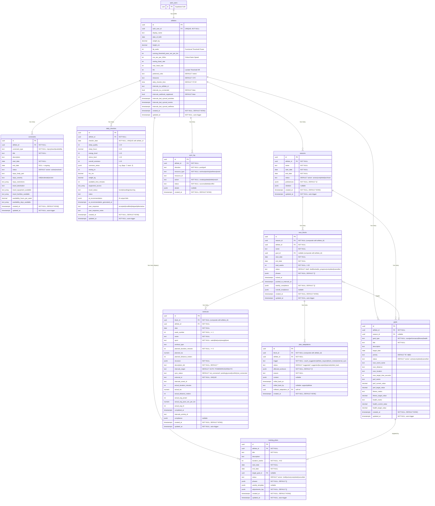

# Khepri Database Schema

This document describes the Supabase/PostgreSQL database schema for Khepri.

> **Last Updated**: 2026-04-05
> **Migrations**: `supabase/migrations/001_initial_schema.sql` through `013_season_goals_and_sync.sql`

## Entity Relationship Diagram


```mermaid
erDiagram
    auth_users ||--|| athletes : "has profile"
    athletes ||--o{ goals : "has many"
    athletes ||--o{ constraints : "has many"
    athletes ||--o{ daily_checkins : "has many"
    athletes ||--o{ training_plans : "has many (legacy)"
    athletes ||--o{ seasons : "has many"
    athletes ||--o{ sync_log : "has many"
    goals ||--o| training_plans : "targeted by"
    seasons ||--o{ race_blocks : "has many"
    seasons ||--o{ goals : "has many"
    race_blocks ||--o{ workouts : "has many"
    race_blocks ||--o{ plan_adaptations : "has many"
    race_blocks }o--o| goals : "targets"

    auth_users {
        uuid id PK "Supabase Auth"
    }

    athletes {
        uuid id PK
        uuid auth_user_id FK "UNIQUE, NOT NULL"
        text display_name
        date date_of_birth
        decimal weight_kg
        decimal height_cm
        int ftp_watts "Functional Threshold Power"
        int running_threshold_pace_sec_per_km
        int css_sec_per_100m "Critical Swim Speed"
        int resting_heart_rate
        int max_heart_rate
        int lthr "Lactate Threshold HR"
        text preferred_units "DEFAULT 'metric'"
        text timezone "DEFAULT 'UTC'"
        time daily_checkin_time "DEFAULT '07:00'"
        text intervals_icu_athlete_id
        bool intervals_icu_connected "DEFAULT false"
        bool intervals_webhook_registered "DEFAULT false"
        timestamptz intervals_last_synced_activities
        timestamptz intervals_last_synced_events
        timestamptz intervals_last_synced_wellness
        timestamptz created_at "NOT NULL, DEFAULT NOW()"
        timestamptz updated_at "NOT NULL, auto-trigger"
    }

    goals {
        uuid id PK
        uuid athlete_id FK "NOT NULL"
        uuid season_id FK "nullable"
        text goal_type "NOT NULL: race|performance|fitness|health"
        text title "NOT NULL"
        text description
        date target_date
        text priority "DEFAULT 'B': A|B|C"
        text status "DEFAULT 'active': active|completed|cancelled"
        text race_event_name
        text race_distance
        text race_location
        int race_target_time_seconds
        text perf_metric
        decimal perf_current_value
        decimal perf_target_value
        text fitness_metric
        decimal fitness_target_value
        text health_metric
        decimal health_current_value
        decimal health_target_value
        timestamptz created_at "NOT NULL, DEFAULT NOW()"
        timestamptz updated_at "NOT NULL, auto-trigger"
    }

    constraints {
        uuid id PK
        uuid athlete_id FK "NOT NULL"
        text constraint_type "NOT NULL: injury|travel|availability"
        text title "NOT NULL"
        text description
        date start_date "NOT NULL"
        date end_date "NULL = ongoing"
        text status "DEFAULT 'active': active|resolved"
        text injury_body_part
        text injury_severity "mild|moderate|severe"
        text_array injury_restrictions
        text travel_destination
        text_array travel_equipment_available
        text_array travel_facilities_available
        decimal availability_hours_per_week
        text_array availability_days_available
        timestamptz created_at "NOT NULL, DEFAULT NOW()"
        timestamptz updated_at "NOT NULL, auto-trigger"
    }

    daily_checkins {
        uuid id PK
        uuid athlete_id FK "NOT NULL"
        date checkin_date "NOT NULL, UNIQUE with athlete_id"
        int sleep_quality "1-10"
        decimal sleep_hours "0-24"
        int energy_level "1-10"
        int stress_level "1-10"
        int overall_soreness "1-10"
        jsonb soreness_areas "e.g. {legs: 7, back: 3}"
        int resting_hr
        decimal hrv_ms
        decimal weight_kg
        int available_time_minutes
        text_array equipment_access
        text travel_status "home|traveling|returning"
        text notes
        jsonb ai_recommendation "AI output blob"
        timestamptz ai_recommendation_generated_at
        text user_response "accepted|modified|skipped|alternative"
        text user_response_notes
        timestamptz created_at "NOT NULL, DEFAULT NOW()"
        timestamptz updated_at "NOT NULL, auto-trigger"
    }

    training_plans {
        uuid id PK
        uuid athlete_id FK "NOT NULL"
        text title "NOT NULL"
        text description
        int duration_weeks "NOT NULL, 4-52"
        date start_date "NOT NULL"
        date end_date "NOT NULL"
        uuid target_goal_id FK "nullable"
        text status "DEFAULT 'active': draft|active|completed|cancelled"
        jsonb phases "NOT NULL, DEFAULT []"
        jsonb weekly_template "nullable"
        jsonb adjustments_log "NOT NULL, DEFAULT []"
        timestamptz created_at "NOT NULL, DEFAULT NOW()"
        timestamptz updated_at "NOT NULL, auto-trigger"
    }

    seasons {
        uuid id PK
        uuid athlete_id FK "NOT NULL"
        text name "NOT NULL"
        date start_date "NOT NULL"
        date end_date "NOT NULL"
        text status "DEFAULT 'active': active|completed|archived"
        jsonb preferences "NOT NULL, DEFAULT '{}'"
        jsonb skeleton "nullable"
        timestamptz created_at "NOT NULL, DEFAULT NOW()"
        timestamptz updated_at "NOT NULL, auto-trigger"
    }

    race_blocks {
        uuid id PK
        uuid season_id FK "NOT NULL (composite with athlete_id)"
        uuid athlete_id FK "NOT NULL"
        text name "NOT NULL"
        uuid goal_id FK "nullable (composite with athlete_id)"
        date start_date "NOT NULL"
        date end_date "NOT NULL"
        int total_weeks "NOT NULL, 1-52"
        text status "DEFAULT 'draft': draft|locked|in_progress|completed|cancelled"
        jsonb phases "NOT NULL, DEFAULT '[]'"
        timestamptz locked_at
        timestamptz pushed_to_intervals_at
        jsonb weekly_compliance "NOT NULL, DEFAULT '[]'"
        jsonb overall_compliance "nullable"
        timestamptz created_at "NOT NULL, DEFAULT NOW()"
        timestamptz updated_at "NOT NULL, auto-trigger"
    }

    workouts {
        uuid id PK
        uuid block_id FK "NOT NULL (composite with athlete_id)"
        uuid athlete_id FK "NOT NULL"
        date date "NOT NULL"
        int week_number "NOT NULL, >= 1"
        text name "NOT NULL"
        text sport "NOT NULL: swim|bike|run|strength|rest"
        text workout_type
        int planned_duration_minutes "NOT NULL, >= 0"
        numeric planned_tss
        int planned_distance_meters
        jsonb structure "NOT NULL"
        text description_dsl "NOT NULL, DEFAULT ''"
        text intervals_target "DEFAULT 'AUTO': POWER|PACE|HR|AUTO"
        text sync_status "DEFAULT 'not_connected': pending|synced|conflict|not_connected"
        text external_id "NOT NULL, UNIQUE"
        text intervals_event_id
        int actual_duration_minutes
        numeric actual_tss
        int actual_distance_meters
        int actual_avg_power
        numeric actual_avg_pace_sec_per_km
        int actual_avg_hr
        timestamptz completed_at
        text intervals_activity_id
        jsonb compliance "nullable"
        timestamptz created_at "NOT NULL, DEFAULT NOW()"
        timestamptz updated_at "NOT NULL, auto-trigger"
    }

    plan_adaptations {
        uuid id PK
        uuid block_id FK "NOT NULL (composite with athlete_id)"
        uuid athlete_id FK "NOT NULL"
        text trigger "NOT NULL: coach_suggestion|athlete_request|block_review|external_sync"
        text status "DEFAULT 'suggested': suggested|accepted|rejected|rolled_back"
        jsonb affected_workouts "NOT NULL, DEFAULT '[]'"
        text reason "NOT NULL"
        jsonb context "nullable"
        timestamptz rolled_back_at
        text rolled_back_by "nullable: support|athlete"
        uuid rollback_adaptation_id FK "self-ref"
        timestamptz created_at "NOT NULL, DEFAULT NOW()"
    }

    sync_log {
        uuid id PK
        uuid athlete_id FK "NOT NULL"
        text direction "NOT NULL: push|pull"
        text resource_type "NOT NULL: workout|activity|wellness|event"
        text resource_id
        text action "NOT NULL: create|update|delete|match"
        text status "NOT NULL: success|failed|conflict"
        jsonb details "nullable"
        timestamptz created_at "NOT NULL, DEFAULT NOW()"
    }
```

## Tables Overview

| Table | Purpose | RLS | Migration |
|-------|---------|-----|-----------|
| `athletes` | Athlete profiles, fitness numbers, preferences, sync state | By `auth_user_id` | 001, 013 |
| `goals` | Race, performance, fitness, health goals (linked to seasons) | Via `athlete_id` | 001, 013 |
| `constraints` | Injuries, travel, availability changes | Via `athlete_id` | 001 |
| `daily_checkins` | Daily wellness + AI recommendations | Via `athlete_id` | 001 |
| `training_plans` | Legacy periodized training plans | Via `athlete_id` | 006 |
| `seasons` | Season-level planning with skeleton and preferences | Via `athlete_id` | 010 |
| `race_blocks` | Training blocks within a season (e.g. base, build, taper) | Via `athlete_id` | 010 |
| `workouts` | Individual workout sessions with planned/actual data | Via `athlete_id` | 011 |
| `plan_adaptations` | Audit trail for workout modifications | Via `athlete_id` | 012 |
| `sync_log` | Intervals.icu sync operation log | Service role only | 012 |
| `conversations` | Chat conversations | Via `athlete_id` | 002 |
| `messages` | Chat messages within conversations | Via conversation | 002 |
| `intervals_credentials` | Encrypted Intervals.icu API keys | Via `athlete_id` | 003 |
| `embeddings` | RAG embeddings for knowledge base | Via `athlete_id` | 005 |

## JSONB Columns

The schema uses JSONB for flexible/evolving structures:

| Table | Column | Structure | Rationale |
|-------|--------|-----------|-----------|
| `daily_checkins` | `soreness_areas` | `{legs: 7, back: 3, ...}` | Variable body parts, simple map |
| `daily_checkins` | `ai_recommendation` | Freeform AI output | Structure evolves with AI features |
| `training_plans` | `phases` | `[{name, start_week, end_week, focus, description}]` | Nested structure, read as unit |
| `training_plans` | `weekly_template` | `{monday: {sport, workout_type, duration, intensity}, ...}` | Template structure, read as unit |
| `training_plans` | `adjustments_log` | `[{date, reason, changes, ai_generated}]` | Append-only log |
| `seasons` | `preferences` | `{min_hours, max_hours, training_days, sport_priority}` | User training preferences |
| `seasons` | `skeleton` | `[{type, name, weeks, hours_per_week, start_date, end_date, focus}]` | AI-generated season structure |
| `race_blocks` | `phases` | `[{type, name, weeks, focus}]` | Block periodization phases |
| `race_blocks` | `weekly_compliance` | `[{week, score, completed, planned}]` | Per-week compliance tracking |
| `race_blocks` | `overall_compliance` | `{score, total_planned, total_completed}` | Block-level compliance summary |
| `workouts` | `structure` | `[{type, description, duration_minutes, zone, ...}]` | Workout sections (warmup, main, cooldown) |
| `workouts` | `compliance` | `{score, metric, planned, actual, ratio}` | Per-workout compliance calculation |
| `plan_adaptations` | `affected_workouts` | `[{workout_id, before, after}]` | Snapshot of changes for audit |
| `plan_adaptations` | `context` | `{checkin_id, wellness_scores, nearby_workouts}` | Context that triggered the adaptation |
| `sync_log` | `details` | `{intervals_id, matched_workout, error, ...}` | Sync operation metadata |

## Timestamps

All tables use UTC timestamps with automatic management:

- **`created_at`**: Set automatically on INSERT via `DEFAULT NOW()`
- **`updated_at`**: Set automatically on UPDATE via database trigger

```sql
CREATE OR REPLACE FUNCTION update_updated_at_column()
RETURNS TRIGGER AS $$
BEGIN
    NEW.updated_at = NOW();
    RETURN NEW;
END;
$$ language 'plpgsql';
```

## Row Level Security (RLS)

All tables have RLS enabled. Users can only access their own data:

- **`athletes`**: Filtered by `auth.uid() = auth_user_id`
- **Most tables**: Filtered by `athlete_id IN (SELECT id FROM athletes WHERE auth_user_id = auth.uid())`
- **`sync_log`**: Service role only — accessed by Edge Functions, not directly by users

## Indexes

```text
Athletes:
  idx_athletes_auth_user_id ON athletes(auth_user_id)

Goals:
  idx_goals_athlete_id ON goals(athlete_id)
  idx_goals_status ON goals(status)
  idx_goals_target_date ON goals(target_date)
  idx_goals_season ON goals(season_id)

Constraints:
  idx_constraints_athlete_id ON constraints(athlete_id)
  idx_constraints_status ON constraints(status)
  idx_constraints_dates ON constraints(start_date, end_date)

Daily Check-ins:
  idx_daily_checkins_athlete_id ON daily_checkins(athlete_id)
  idx_daily_checkins_date ON daily_checkins(checkin_date DESC)
  idx_daily_checkins_athlete_date ON daily_checkins(athlete_id, checkin_date DESC)

Training Plans:
  idx_training_plans_athlete_id ON training_plans(athlete_id)
  idx_training_plans_status ON training_plans(status)
  idx_training_plans_dates ON training_plans(start_date, end_date)

Seasons:
  idx_seasons_one_active ON seasons(athlete_id) WHERE status = 'active' [UNIQUE]

Race Blocks:
  idx_race_blocks_season ON race_blocks(season_id)
  idx_race_blocks_athlete_status ON race_blocks(athlete_id, status)

Workouts:
  idx_workouts_block ON workouts(block_id)
  idx_workouts_athlete_date ON workouts(athlete_id, date)
  idx_workouts_unique_external ON workouts(external_id) [UNIQUE]

Plan Adaptations:
  idx_adaptations_block ON plan_adaptations(block_id)
  idx_adaptations_athlete ON plan_adaptations(athlete_id, created_at DESC)

Sync Log:
  idx_sync_log_athlete ON sync_log(athlete_id, created_at DESC)
```

## Enums (CHECK Constraints)

| Column | Valid Values |
|--------|--------------|
| `athletes.preferred_units` | `metric`, `imperial` |
| `goals.goal_type` | `race`, `performance`, `fitness`, `health` |
| `goals.priority` | `A`, `B`, `C` |
| `goals.status` | `active`, `completed`, `cancelled` |
| `constraints.constraint_type` | `injury`, `travel`, `availability` |
| `constraints.status` | `active`, `resolved` |
| `constraints.injury_severity` | `mild`, `moderate`, `severe` |
| `daily_checkins.travel_status` | `home`, `traveling`, `returning` |
| `daily_checkins.user_response` | `accepted`, `modified`, `skipped`, `alternative` |
| `training_plans.status` | `draft`, `active`, `completed`, `cancelled` |
| `seasons.status` | `active`, `completed`, `archived` |
| `race_blocks.status` | `draft`, `locked`, `in_progress`, `completed`, `cancelled` |
| `workouts.sport` | `swim`, `bike`, `run`, `strength`, `rest` |
| `workouts.intervals_target` | `POWER`, `PACE`, `HR`, `AUTO` |
| `workouts.sync_status` | `pending`, `synced`, `conflict`, `not_connected` |
| `plan_adaptations.trigger` | `coach_suggestion`, `athlete_request`, `block_review`, `external_sync` |
| `plan_adaptations.status` | `suggested`, `accepted`, `rejected`, `rolled_back` |
| `plan_adaptations.rolled_back_by` | `support`, `athlete` |
| `sync_log.direction` | `push`, `pull` |
| `sync_log.resource_type` | `workout`, `activity`, `wellness`, `event` |
| `sync_log.action` | `create`, `update`, `delete`, `match` |
| `sync_log.status` | `success`, `failed`, `conflict` |

## Notable Constraints

| Constraint | Table | Description |
|------------|-------|-------------|
| `seasons_date_range` | `seasons` | `end_date >= start_date` |
| `race_blocks_date_range` | `race_blocks` | `end_date >= start_date` |
| `idx_seasons_one_active` | `seasons` | Only one active season per athlete (partial unique index) |
| `race_blocks_season_fk` | `race_blocks` | Composite FK `(season_id, athlete_id)` ensures same-athlete ownership |
| `race_blocks_goal_fk` | `race_blocks` | Composite FK `(goal_id, athlete_id)` ensures goal belongs to same athlete |
| `goals_season_fk` | `goals` | Composite FK `(season_id, athlete_id)` links goals to seasons |
| `idx_workouts_unique_external` | `workouts` | Unique `external_id` for idempotent upserts |
